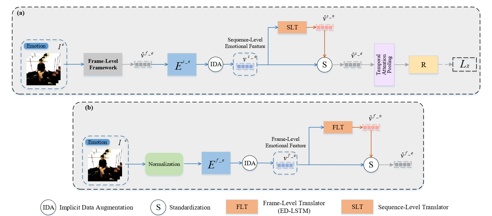

## CMIS-Net: A Cascaded Multi-Scale Individual Standardization Network for Backchannel Agreement Estimation

**CMIS-Net** proposes a multi-scale approach for backchannel agreement estimation. The method performs individual standardization at both the frame-level and sequence-level, extracting individual-invariant features that are then used for more accurate backchannel agreement estimation.
[Paper](https://arxiv.org/abs/2510.17855)



## Dataset
Our model was trained and validated on [MPIIGroupInteraction](https://multimediate-challenge.org/datasets/Dataset_MPII/) dataset.  

We specifically used the **backchannel agreement annotations** provided in the dataset to perform the **agreement estimation** task.

## Usage

Before starting the training, make sure to extract facial keypoints from each video frame using [OpenFace2.0](https://github.com/TadasBaltrusaitis/OpenFace).

To run the training you can call:

```sh
bash train.sh
```

or 

```
python train.py --feat_path /Path/to/your/features --label_path /Path/to/your/labels
```

## Acknowledge
This repository references the source code of the following paper：
[ISNet](https://github.com/tobefans/ISNet_SER)

## Citation

If you find our code useful in your research, please consider citing our paper:

```
@article{huang2025cmis,
  title={CMIS-Net: A Cascaded Multi-Scale Individual Standardization Network for Backchannel Agreement Estimation},
  author={Huang, Yuxuan and Wang, Kangzhong and Fu, Eugene Yujun and Ngai, Grace and Ng, Peter HF},
  journal={arXiv preprint arXiv:2510.17855},
  year={2025}
}
```
